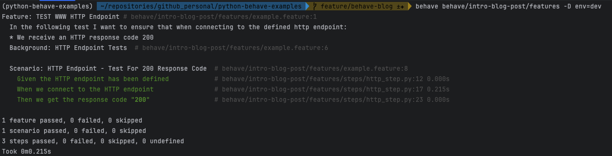

## What is Python behave?

Python behave is a Behaviour driven development (BDD) tool that is used to test the behavior of a particular solution;
this can be anything from a website to cloud computing infrastructure. It's a great tool to test your solutions from an
"external" perspective; what I mean here is that it doesn't care about the code used to develop a particular solution,
unlike unit tests, but rather, focuses on the behavior of the solution itself.
{: .text-justify}

## Example Use Case

To keep thins simple, I've used a very basic use case, which hopefully, shows you how simple this can be to set up, but
also how this can be expanded to perform more complex testing.
{: .text-justify}

* Use case: Check to see if a given endpoint returns an HTTP response code of 200.

## Setup

You first need to install [behave](https://pypi.org/project/behave/). I suggest that this forms part of your Pipfile;
here's an [example](https://github.com/donovan-said/python-behave-examples/blob/main/Pipfile) of this.
{: .text-justify}

## Basic Structure

The basic structure for a behave directory comprises the root behave path, the features path, which contains your
environment.py and your feature files, and finally a steps path, which contains the steps python scripts actually
performing the defined tests. These will all be discussed in more detail in the following sections.
{: .text-justify}

Below is an example of this:

```shell
└── behave
    └── features
        ├── __init__.py
        ├── environment.py
        ├── example.feature
        └── steps
            └── common_steps.py
```

### Environment File

TBC



### Feature file

The feature file is where we define our test case(s) in natural language, specifically by using the [Gherkin Language](https://behave.readthedocs.io/en/stable/gherkin.html#gherkin-feature-testing-language).
This essentially follows a format which is defined by specific keywords, such as "Feature", "Background", "Scenario",
"Given", "When", "Then". There are more, though for the purpose of this blog, we'll stick to these.
{: .text-justify}

This should look something like the following:



#### Feature

The `Feature` encapsulates all tests executed against a particular solutions feature. A `Feature` can contain one or
many `Scenarios`.
{: .text-justify}

#### Background

The `Background` is used to provide context to the `Fetaure`, and makes available context to each `Scenario` defined
within the `Feature`. This is executed prior to each `Scenario`, though for the purpose of this blog, I've simply
included this for structural purposes, and am not actually passing useful context to the  `Scenario` from it.
{: .text-justify}

#### Scenario

The `Scenario` is where the nitty-gritty happens. This is where we define what actions we want to make for this
particular test. This should be limited in scope; you can think of this like a unit test. As you'll have noticed in the
example above, it's within this section that we make use of the `Given`, `When`, `Then` keywords. These directly
correspond to functions defined in the steps.py file (discussed below) with the use of decorators, specifically
`@given`, `@when`, and `@then`.
{: .text-justify}

### Step File

As mentioned above, the steps.py file(s) is where we define our functions that actually perform the tasks defined in the
`Scenarions`. These are tied together by the use of decorators, as can be seen in the example below. I'd like to also
mention that these functions can be used across multiple `Scenarios`, so make sure to not hardcode anything that's
`Scenario` specific into them. Instead, pass in variables via the `Scenario` itself. You can see an example of this in
the `@then('we get the response code "{status_code}"')` decorator and function, where the `status_code` is passed in via
the `Scenario` (refer back to the Feature file sample code).
{: .text-justify}



## Running your tests

#### behave cli

The behave package comes with a cli tool, which is what's used to execute the tests. There are a bunch of features that
the CLI tool provides, though I won't cover them here, exception for the ```-D``` command, which allows us to provide
additional userdata in the format of key,value pairs. This is how I passed in the env value in the environment.py file.
{: .text-justify}

#### Execution

Executing these tests is very simple. You just need to provide the feature path and any additional flags; in this case
the ```-D``` command to input the environment.
{: .text-justify}

```shell
behave path/to/features -D env=dev
```

#### Output

In the following image, you can see how the feature was executed and the results of the tests.



## Summary

Hopefully, you've gained some insight from this post; it had taken me a while to wrap my head around how all the pieces
tied together, so I wanted to write this down in as simple a format as I could. I aim to follow this up with some more
complex examples. In the meantime, happy coding :raised_hands:
{: .text-justify}

## Further Reading and References

* [Source Code](https://github.com/donovan-said/python-behave-examples/tree/main/behave/intro-blog-post/features)
* [behave - ReadTheDocs](https://behave.readthedocs.io/en/stable/index.html)
* [Tutorials Point - behave](https://www.tutorialspoint.com/behave/index.htm)